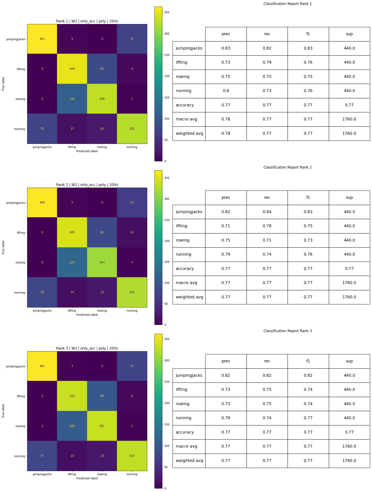
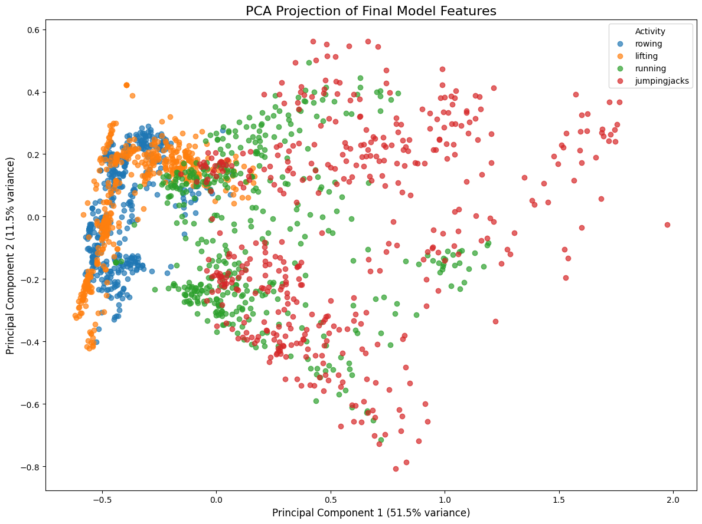

## Preprocessing ##

The preprocessing pipeline consisted of the following steps:

* Loading the raw sensor recordings from CSV files
* Converting gyroscope measurements to a consistent unit (radians per second)
* Splitting the dataset either using a stratified random train-test split (80/20) or Leave-One-Subject-Out (LOSO) cross validation
* Segmenting the recordings into fixed-size non-overlapping time windows
* Extracting statistical and frequency-based features for each time window:
    * Accelerometer and gyroscope x/y/z mean, standard deviation, minimum, and maximum
    * Accelerometer and gyroscope signal magnitude mean and standard deviation
    * Accelerometer and gyroscope dominant frequency
* Extracting dominant frequency features by applying a Fast Fourier Transform (FFT) to the accelerometer and gyroscope magnitude signals
* Applying feature scaling and normalization using Standard Scaling followed by Min-Max Normalization

## Iterative Model Development Process ##

The model development process was performed iteratively. Initial experiments were used to explore the influence of different preprocessing and classifier configurations before narrowing down the final evaluation setup.

The first experiments focused on comparing different SVM kernel functions:

* Linear
* Radial Basis Function (RBF)
* Polynomial

Additionally, different multiclass classification strategies were evaluated:

* Standard multiclass SVM
* One-vs-One
* One-vs-Rest

These configurations were initially tested using different window lengths between one and five seconds based on a stratified random train-test split.

After the initial experiments, additional tests were performed to compare the impact of different sampling rates. Both 20 Hz and 100 Hz recordings were evaluated while keeping the same sampling rate in both training and testing.

Subsequently, multiple feature subsets were created to analyze the contribution of different feature groups. The experiments explored the following combinations:

| Feature Set | Description |
|---|---|
| `all_features` | Uses all extracted accelerometer and gyroscope features including statistical, strength, and frequency-domain features |
| `no_freq` | Uses all features except dominant frequency features |
| `no_strength` | Uses all features except accelerometer and gyroscope signal magnitude features |
| `only_acc` | Uses only accelerometer-based features |
| `only_acc_no_strength` | Uses only accelerometer features without accelerometer signal magnitude features |
| `only_gyro` | Uses only gyroscope-based features |
| `only_mean_std` | Uses only mean and standard deviation features |
| `only_min_max` | Uses only minimum and maximum features |
| `only_acc_no_freq` | Uses only accelerometer features without frequency-domain features |
| `only_acc_only_mean_std` | Uses only accelerometer mean and standard deviation features |
| `only_acc_only_min_max` | Uses only accelerometer minimum and maximum features |
| `only_acc_no_freq_no_strength` | Uses only accelerometer statistical features without frequency-domain and strength features |
| `only_acc_with_gyro_freq_and_strength` | Uses accelerometer features combined with gyroscope frequency and strength features |
| `only_acc_with_gyro_freq` | Uses accelerometer features combined with gyroscope dominant frequency features |

The feature subsets were again evaluated using different kernels and window lengths using the random train-test split.

However, during later experiments it became apparent that the random split evaluation produced overly optimistic performance estimates because recordings from the same subjects were present in both training and testing data.

Therefore, the evaluation procedure was revised and the best-performing configurations from the random split experiments were reevaluated using Leave-One-Subject-Out (LOSO) cross validation. Compared to the random split evaluation, the LOSO results showed significantly lower performance scores, indicating reduced generalization capability for unseen subjects.

Based on the LOSO results, the most promising configurations were selected for final hyperparameter optimization using systematic parameter grid search.

## Final Evaluation Flow ##

To ensure a fair and systematic evaluation, all relevant preprocessing and model configurations were evaluated as complete combinations. Testing individual parameters sequentially could lead to biased conclusions, since the performance of one parameter often depends on the selected values of the others.
Therefore, the evaluation was divided into multiple phases.

### Phase 1 ###
Try every combination with LOSO Split

* Sample Rate (20 Hz and 100 Hz)

* Window Lengths 1, 2, 3, 4 and 5

* All 14 Feature Sets

* 3 Kernels (linear, rbf, poly)

* 3 Strategies (normal, one vs one, one vs rest)

= 11 340 different combinations

### Phase 2: ###
Take the top 5 configurations based on their avg macro f1 from Phase 1 results

Now test the hyperparameter configuration. 
* Test each with differnt C, gamma, degree, scale and coef0

### Phase 3: ###
Again take the top 3 configurations based on their average macro f1 score from Phase 2 results

Compare them by their confusion matrix and classification report and select final model

## Final Evaluation Workflow ##

### Phase 1 - Results ###

All configuration combinations were evaluated using Leave-One-Subject-Out (LOSO) cross validation.  
The model performance was measured using the average Macro F1 Score across all LOSO iterations.

The following table shows the top 5 performing configurations from Phase 1 based on their average Macro F1 Score.

| Window Length | Feature Set | Strategy | Kernel | Sample Rate | Accuracy | Macro F1 |
|---|---|---|---|---|---|---|
| 2 | `only_acc` | normal | poly | 100 Hz | 0.712923 | 0.694928 |
| 2 | `only_acc_with_gyro_freq` | normal | poly | 100 Hz | 0.709813 | 0.691487 |
| 2 | `only_acc_with_gyro_freq` | normal | poly | 20 Hz | 0.713056 | 0.682575 |
| 2 | `only_acc` | normal | poly | 20 Hz | 0.711389 | 0.682430 |
| 3 | `only_acc_with_gyro_freq` | normal | poly | 20 Hz | 0.711111 | 0.678935 |

The top five configurations achieved very similar performance results. All high-performing models used the polynomial kernel together with the standard multiclass SVM strategy, indicating that this combination was generally more suitable for the selected activity recognition task than the linear or RBF kernels.

Also only two feature sets `only_acc` and `only_acc_with_gyro_freq` are represented. 

The best rbf kernel achieved a average macro f1 score of 0.645222.
The best linear kernel achieved 0.610215 average macro f1.

### Phase 2 - Results ###

The top 5 configurations of Phase 1 were then tested on different hyperparameter configurations.

The hyperparameter optimization used the following parameter grid. Since all top-performing configurations from Phase 1 used the polynomial kernel, only the polynomial SVM kernel was considered during hyperparameter tuning.

| Hyperparameter | Tested Values |
|---|---|
| Kernel | `poly` |
| C | `0.1`, `1`, `10` |
| Degree | `2`, `3`, `4` |
| Gamma | `scale`, `0.1`, `0.01` |
| Coef0 | `0.0`, `0.5`, `1.0`, `2.0` |

This resulted in:
$3 \times 3 \times 3 \times 4 = 108$
different hyperparameter combinations per configuration.

The following table shows the top 3 configurations after hyperparameter optimization based on the average Macro F1 Score across all 540 different combinations of hyperparameter and configuration.

| Window Length | Feature Set | Strategy | Sample Rate | C | Degree | Gamma | Coef0 | Kernel | Accuracy | Macro F1 |
|---|---|---|---|---|---|---|---|---|---|---|
| 2 | `only_acc` | normal | 20 Hz | 10.0 | 4 | scale | 0.0 | poly | 0.773333 | 0.766836 |
| 2 | `only_acc` | normal | 20 Hz | 10.0 | 4 | scale | 1.0 | poly | 0.766111 | 0.758987 |
| 2 | `only_acc` | normal | 20 Hz | 10.0 | 3 | scale | 1.0 | poly | 0.766806 | 0.757798 |

The results show that all top-performing models used the `only_acc` feature set together with a polynomial SVM kernel and a sampling rate of 20 Hz. Additionally, a window length of two seconds consistently achieved the best performance. The best overall configuration achieved an average Macro F1 Score of 0.7668.

### Phase 3 - Results ###

  

  <em>Figure 1: Confusion matrix and classification report of the final 3 models.</em>

The confusion matrices and classification reports show that all three final candidate models achieved very similar overall performance. Each model reached an accuracy and Macro F1 Score of approximately 0.77, indicating stable and balanced classification performance across all activity classes.

The strongest class across all models was jumpingjacks, which achieved the highest precision and F1 scores. This suggests that the movement pattern of jumping jacks was comparatively easy to distinguish from the other activities.

The classes lifting and rowing caused the largest number of misclassifications. In particular, many rowing samples were incorrectly predicted as lifting and vice versa. This indicates that both activities produce similar motion patterns in the extracted accelerometer features.

The running class also showed some confusion with jumpingjacks, especially in the first and third models. This may be caused by repetitive full-body movement characteristics shared between both activities.

Although the overall performance differences between the three models are relatively small, the first-ranked model achieved the best balance across all classes. It produced the highest Macro F1 Score and showed slightly more consistent classification performance for lifting and rowing compared to the other configurations.

Overall, the results demonstrate that the selected polynomial SVM configuration using accelerometer-based features and a 20 Hz sampling rate generalized well across unseen subjects under LOSO evaluation.

## Final Model Analysis ## 

  

  <em>Figure 2: PCA projection of the final model feature space.</em>

The PCA projection shows that the activity classes are partially separable in the reduced two-dimensional feature space. However, several overlapping regions between the classes are still visible, especially between lifting and rowing as well as between running and jumpingjacks. These overlaps correspond to the misclassifications observed in the confusion matrices and indicate that some activities produce similar motion patterns in the extracted accelerometer features. Despite these overlaps, the clusters remain sufficiently distinguishable to achieve good overall classification performance.

## Comparison of LOSO and Random Test Split ##

### Result of Phase 1 on Random Test Split compared to LOSO ###

### Random Train-Test Split Results

| Window Length | Feature Set | Strategy | Kernel | Sample Rate | Accuracy | Macro F1 |
|---|---|---|---|---|---|---|
| 3 | `only_acc_with_gyro_freq_and_strength` | one_vs_one | poly | 100 Hz | 0.923077 | 0.922532 |
| 3 | `only_acc_with_gyro_freq` | one_vs_one | poly | 100 Hz | 0.918269 | 0.917711 |
| 4 | `only_acc_with_gyro_freq` | normal | poly | 100 Hz | 0.916667 | 0.916618 |
| 4 | `only_acc_with_gyro_freq_and_strength` | one_vs_one | poly | 100 Hz | 0.916667 | 0.916602 |
| 3 | `only_acc` | one_vs_one | poly | 100 Hz | 0.913462 | 0.913258 |

### LOSO Results

| Window Length | Feature Set | Strategy | Kernel | Sample Rate | Accuracy | Macro F1 |
|---|---|---|---|---|---|---|
| 2 | `only_acc` | normal | poly | 100 Hz | 0.712923 | 0.694928 |
| 2 | `only_acc_with_gyro_freq` | normal | poly | 100 Hz | 0.709813 | 0.691487 |
| 2 | `only_acc_with_gyro_freq` | normal | poly | 20 Hz | 0.713056 | 0.682575 |
| 2 | `only_acc` | normal | poly | 20 Hz | 0.711389 | 0.682430 |
| 3 | `only_acc_with_gyro_freq` | normal | poly | 20 Hz | 0.711111 | 0.678935 |

The comparison between the random train-test split and the LOSO evaluation shows a substantial performance difference.  
While the best configurations in the random split evaluation achieved Macro F1 scores above 0.92, the best LOSO configurations only reached approximately 0.69 before hyperparameter tuning.

This performance gap indicates that the random split evaluation was considerably easier for the model. Since recordings from the same subjects could appear in both training and test sets, the model was able to learn subject-specific movement patterns in addition to the activity patterns themselves.

In contrast, the LOSO evaluation required the model to generalize to completely unseen subjects. This represents a significantly more realistic and challenging evaluation scenario for human activity recognition tasks.

The comparison also showed that the best-performing configurations changed between both evaluation methods. While the random split favored larger window sizes and One-vs-One classification strategies, the LOSO evaluation achieved better generalization with smaller window sizes and the standard multiclass SVM approach.

Overall, the LOSO evaluation provided a more reliable estimate of real-world model performance and was therefore used as the basis of model evaluation.

